# Project 1: AWS Foundation

**Status:** In progress\
**Started:** 09-25-2026\
**Finished:**

Sections fill in as each phase of the build closes. Progress is tracked in the [Project 1 milestone](https://github.com/Snowblind019/aws-platform/milestone/1).

<!-- One-line summary once built: what this layer gives every other stack. -->

## Overview

<!-- One paragraph: what the foundation is, why it exists, and what later stacks get from it. -->

## Architecture

<!-- D2 page 1:  -->
<!-- D2 page 2:  -->

## Stacks

| Stack | Account | What it holds | Lifecycle |
|---|---|---|---|
| `bootstrap` | lab | | Persistent |
| `org` | management | The organization, the `Workloads` OU, and the `lab` account (all imported), three SCPs, the organization CloudTrail trail and its log bucket, budgets, anomaly detection, and cost allocation tags | Persistent |
| `foundation` | lab | | Persistent |
| `modules/tags` | n/a | | n/a |

## Accounts and access

The organization runs with all features enabled, since consolidated-billing-only mode can't use SCPs, tag policies, or trusted access for other services. It has two accounts. The management account holds only org-level resources, and `lab` is where every project deploys. `lab` sits in a `Workloads` OU under the root, and the guardrail SCPs attach to that OU rather than the root. Member account emails are plus-addresses of the management account's email.

The SCP policy type is enabled. AWS attached `FullAWSAccess` to the root, the OU, and both accounts, and it stays attached. The SCPs added later are deny statements on top of it, and detaching it would deny everything.

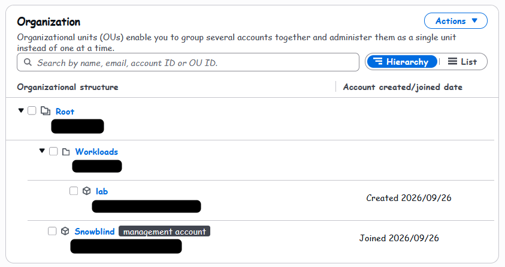

Centralized root access is on, with both of its features: root credentials management and privileged root actions in member accounts. It was turned on before `lab` was created, so `lab` came with no root credentials at all, no password and no access keys. When a task needs root, like unlocking an S3 bucket whose policy denies everyone, the management account opens a short-lived root session into `lab` instead of anyone signing in as its root user.

Once these features are on, the Root access management page in the console only lists the accounts, so the feature check below comes from the CLI.

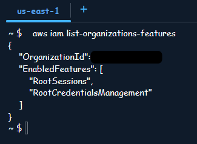

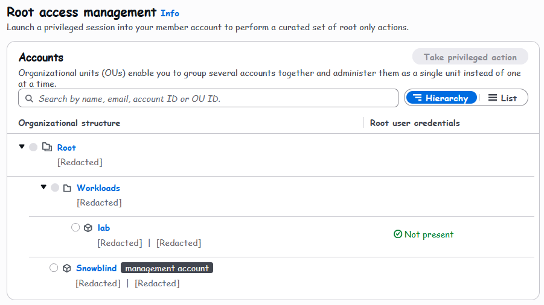

### Identity Center

People get into both accounts through IAM Identity Center, set up as the organization instance in `us-west-2`. MFA is required at every sign-in, not only when the device or location changes. Authenticator apps and security keys are both allowed, and anyone without a registered device has to register one before they can get in.

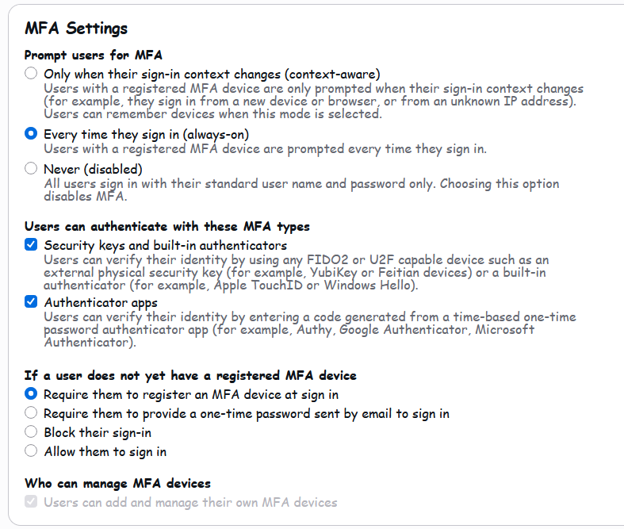

Access is assigned to a `platform-admins` group, not to my user directly, through three permission sets:

| Permission set | Policy | Session | Account | Used for |
|---|---|---|---|---|
| OrgAdmin | AdministratorAccess | 1 hour | Management | Org-level work only, the `org` stack |
| LabAdmin | AdministratorAccess | 4 hours | `lab` | Terraform work on every other stack |
| LabReadOnly | ReadOnlyAccess | 8 hours | `lab` | Looking around without write access |

AdministratorAccess is on purpose for now. Least privilege needs something built to be least-privileged against, so project 5 replaces OrgAdmin and LabAdmin with scoped custom permission sets and brings all of this into Terraform. Because access hangs off the group, that change is a matter of changing group assignments, with nothing to rewire per user.

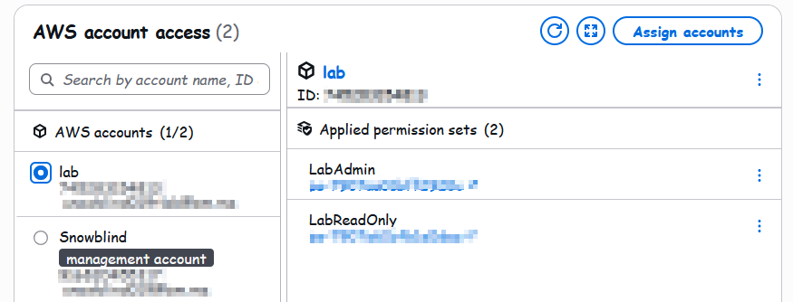

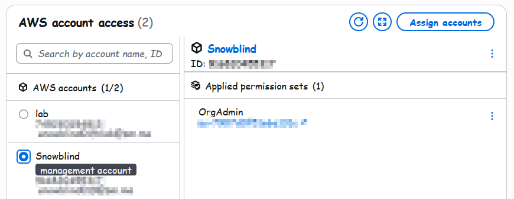

On the command line, one SSO session feeds three profiles, `mgmt-admin`, `lab-admin`, and `lab-readonly`, one per permission set. A single `aws sso login` covers all three, and each profile lands in the right account with the right permission set:

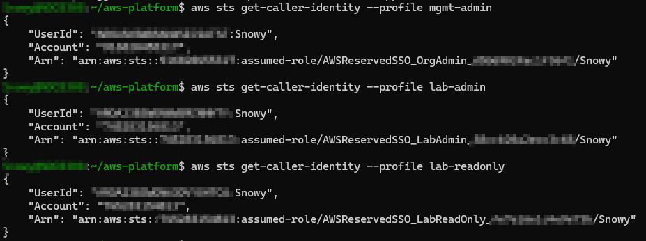

On the work machine, the session gets closed with `aws sso logout` at the end of each shift, which clears the cached tokens.

If Identity Center ever breaks, `lab` keeps the default `OrganizationAccountAccessRole`, which the management account can assume. It's the break-glass way back into `lab`.

### No long-lived keys

Every CLI call now uses short-lived credentials from the SSO session, so the old IAM user's access keys were deleted from the management account and from `~/.aws/credentials`. The credential report in both accounts shows no active access keys, root users included.

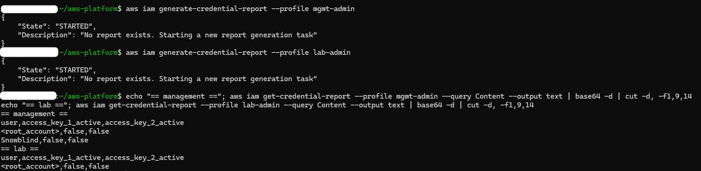

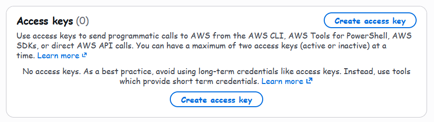

### Bringing the org under Terraform

The organization and `lab` were created by hand in the console, not with Terraform. Creating and closing accounts are one-way doors: a closed account sits in a post-closure period, and an organization can only close so many, so an account should never be anywhere near a `terraform destroy`.

They were adopted into the `org` stack afterward. That stack runs against the management account but keeps its state in the bucket in `lab`, so one run uses two sets of credentials. The backend reads and writes state with the `lab-admin` profile from `AWS_PROFILE`. The provider has its own `profile` argument set to `mgmt-admin`, which wins over the environment variable for the provider only. Every resource in the stack is in the management account, so the one-stack-one-account rule still holds. This stack never runs in CI: GitHub never gets a role in the management account, the one account SCPs can't restrict.

The organization, the OU, and the account were brought in with `import` blocks. Those go through `plan`, so the plan shows exactly what's being adopted, and whether Terraform wants to change anything, before any of it happens. The final plan read 3 to import, 0 to add, 2 to change, 0 to destroy. Both changes were `default_tags` adding the four standard tags to the OU and the account, plus two Terraform-only settings on the account going from null to false.

Getting there took one fix. The first plan wanted to remove `RESOURCE_CONTROL_POLICY` from the organization's enabled policy types: RCPs were enabled on the root, and the code only listed SCPs. Applying that would have disabled RCPs for the whole organization. The service access principals have the same trap, so that list was copied exactly from `aws organizations list-aws-service-access-for-organization`: IAM for centralized root access and SSO for Identity Center, with CloudTrail added later for the organization trail.

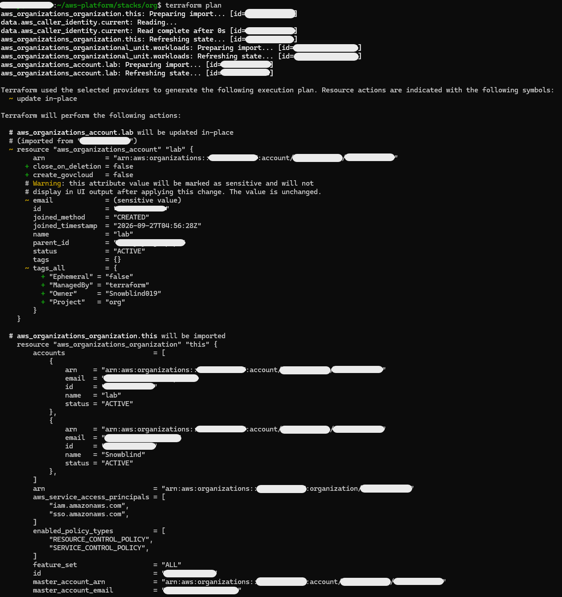

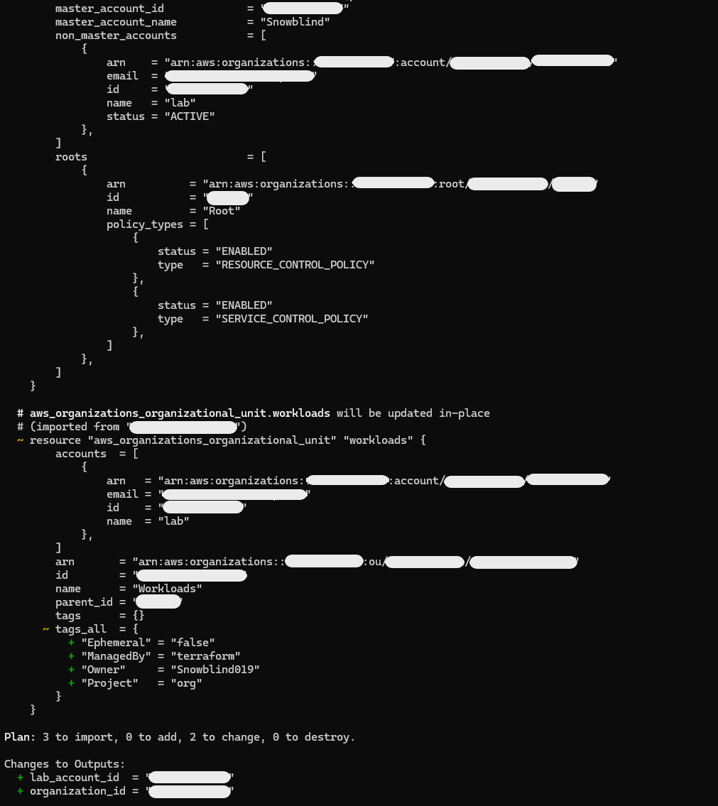

The account resource needed one more thing. Organizations only uses the break-glass role name when an account is created, and no API reads it back, so after an import Terraform sees a difference on `role_name`, and that attribute forces replacement. `ignore_changes` on `role_name` and `iam_user_access_to_billing` removes the false difference, and `role_name` stays in the code as a record of what exists. The account's email comes from a gitignored `terraform.tfvars` and is marked sensitive, so it never shows in the code or in plan output.

All three resources have `prevent_destroy`. Removing the account resource wouldn't close `lab`, it would pull it out of the organization and out from under every SCP. That safety net got used once for real: on a second machine, `terraform.tfvars` had the `lab` email typed slightly differently. A different email forces replacement, so the plan wanted to destroy `lab` and create a new account, and `prevent_destroy` stopped the plan before anything could be applied. Copying the exact address from `aws organizations list-accounts` fixed it.

The import blocks held the real org, OU, and account IDs. They were deleted right after the apply, before the commit, so they never reached the repo.

## State backend

Every stack keeps its state in one S3 bucket in `lab`, created by the `bootstrap` stack. Bootstrap is the one stack that can't start with a remote backend, because the bucket it would point at is the thing it creates. So it was applied once with local state, and then its own state was moved into the bucket it had just made.

The bucket is named `<prefix>-tfstate-<account-id>`. Bucket names are global, so the account ID keeps it unique, and it's read at plan time with the `aws_caller_identity` data source instead of being typed into the code. The bucket's settings:

| Setting | Value | Why |
|---|---|---|
| Versioning | Enabled | Every change to a state file keeps the old copy, so a bad write can be rolled back |
| Encryption | SSE-S3 | State can hold secrets in plain text. New buckets are encrypted by default, but declaring it shows the intent in code. There's no customer managed key yet |
| Public access block | All four settings on | The bucket can't be made public by accident |
| Object ownership | Bucket owner enforced | ACLs are off, so access comes only from IAM and the bucket policy |
| Bucket policy | Deny every request where `aws:SecureTransport` is false | Nobody can read or write state over plain HTTP |
| Lifecycle | Old versions expire after 30 days with the newest 5 always kept. Incomplete uploads are aborted after 7 days | Versioning with no lifecycle grows forever |
| `prevent_destroy` | On | Terraform refuses any plan that would delete the bucket |

Tags come from the shared `modules/tags` module, passed into the provider's `default_tags`, so every resource in the stack carries `Project`, `ManagedBy`, `Owner`, and `Ephemeral` without tagging each one by hand. The module checks that the stack name only uses lowercase letters, digits, and hyphens, and it has no default for `Ephemeral`, so every stack has to say on purpose whether it gets torn down.

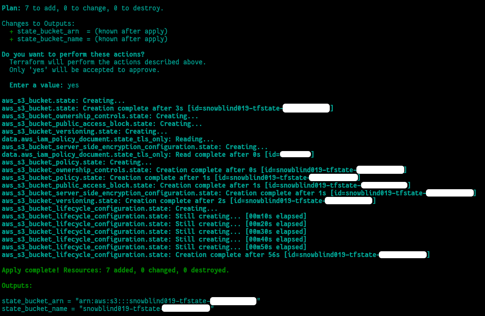

### Moving the state into the bucket

Stacks use partial backend configuration. The settings every stack shares (the bucket, its region, locking, and encryption) live in a gitignored `backend.hcl` at the repo root, and a committed `backend.hcl.example` shows its shape. Each stack's `backend "s3"` block holds only its own `key`, like `aws-platform/bootstrap/terraform.tfstate`. That keeps the bucket name, and the account ID in it, out of the repo. Backend blocks can't read variables anyway, so a file passed in at `terraform init` is how the settings get shared.

Bootstrap's state moved over with `terraform init -migrate-state -backend-config=../backend.hcl`. A plan afterward showed no changes, which proved Terraform was reading state from S3 and that it matched what was built. Only then were the local state files deleted.

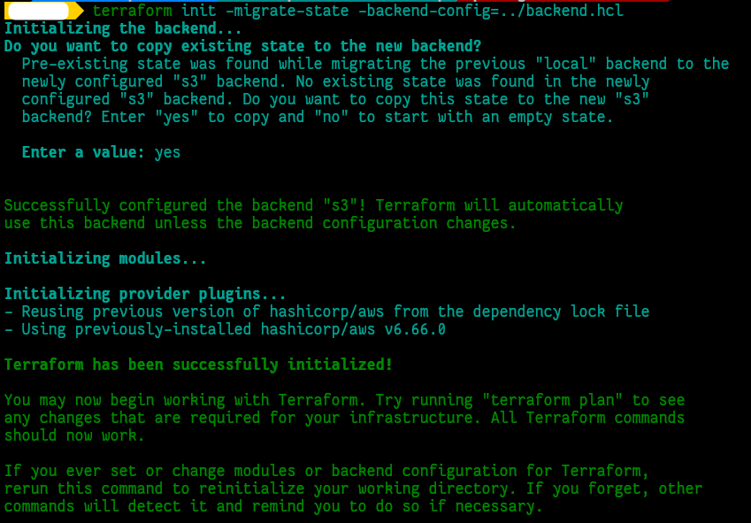

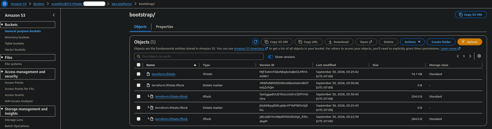

### Locking

Locking uses Terraform's native S3 lockfile (`use_lockfile = true`) instead of a DynamoDB table, which Terraform has deprecated for this. While a plan or apply runs, Terraform writes a `.tflock` object next to the state file, using a conditional write that only succeeds if that object doesn't already exist. When a second run tries, S3 rejects its write with a 412 PreconditionFailed, and Terraform reports it as a lock error.

To test it, one terminal ran `terraform apply -replace=aws_s3_bucket_ownership_controls.state` and left it sitting at the approval prompt. A plain `terraform apply` wouldn't have worked: with nothing to change, it prints No changes and exits without a prompt, so nothing holds the lock. `-replace` forces a plan with one change in it, and the ownership controls are harmless to recreate if the plan gets approved by mistake. While the first terminal waited, `terraform plan` in a second terminal failed with the lock error, showing the lock ID, the operation holding it, and when it was taken.

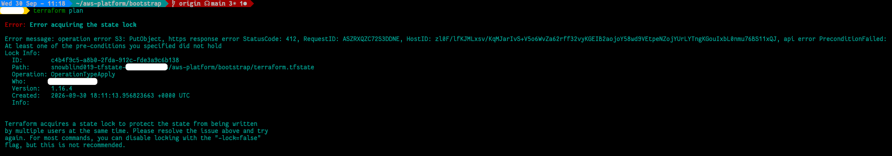

The lock object sat next to the state file for as long as the first terminal waited. Its timestamp, 11:11:14 local time, is one second after the lock's created time in the error, 18:11:13 UTC. Answering no in the first terminal released the lock, and the object was gone on the next refresh.

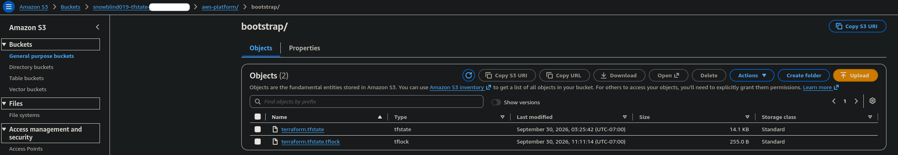

Because the bucket is versioned, S3 doesn't really delete the lock object when a run finishes. Each run leaves a small noncurrent version and a delete marker behind, and the lifecycle rule keeps those from piling up along with the old state versions.

If a crash ever leaves a lock behind, `terraform force-unlock <LOCK_ID>` removes it, but only after confirming nothing else is actually running. Unlocking while another run is writing state is how state gets corrupted.

### prevent_destroy

`terraform plan -destroy` in bootstrap lists all 7 resources for deletion, then stops with "Instance cannot be destroyed" pointing at the bucket. `prevent_destroy` is checked while the plan is built, so the whole plan fails and none of it can be applied, including the settings resources that aren't protected themselves. Deleting this bucket on purpose would mean moving every stack's state out of it first, removing `prevent_destroy`, and emptying every version before a destroy could run.

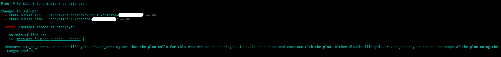

## Guardrails

### Service control policies

Three SCPs attach to the `Workloads` OU, as deny statements on top of `FullAWSAccess`. SCPs never grant anything. They set the ceiling on what IAM inside `lab` can grant, so even a role with AdministratorAccess can't do what an SCP denies. They don't apply to the management account or to service-linked roles.

| Policy | What it denies | Why |
|---|---|---|
| `deny-leave-org` | `organizations:LeaveOrganization` | An account that leaves the org drops every SCP at that moment, so the guardrails could be walked out of from inside |
| `region-lock` | Every action outside `us-west-2` and `us-east-1`, except a list of global services | Fewer regions means fewer places for mistakes and forgotten resources |
| `no-long-lived-keys` | `iam:CreateAccessKey` and `iam:CreateLoginProfile` | Humans come in through Identity Center and machines through OIDC, so there's never a reason for an IAM user credential in `lab` |

`region-lock` denies everything with a `NotAction` list that exempts global services like IAM, Organizations, STS, and Route 53, when `aws:RequestedRegion` isn't one of the two allowed regions. The exemption list was copied from the AWS Control Tower controls reference on 10-01-2026 rather than written from memory. The AWS Organizations user guide has an older version of the same example, missing `sso:*`, `tag:GetResources`, and several newer global services. The allowed regions come from one variable that feeds the policy and is also a stack output, so later stacks read the same list the SCP enforces. A validation on that variable requires `us-west-2`, where the state bucket and Identity Center live.

The policies are built with the `aws_iam_policy_document` data source, and each policy's content comes from its `minified_json`. When an SCP is created through the API, whitespace counts toward the size limit. `region-lock` is 2,891 characters pretty and 1,973 minified. The policies and their attachments are created with `for_each` over a map keyed by policy name, so a new SCP is one more map entry and gets attached the same way.

The `org` stack's state lives in `lab`, the account these SCPs govern. If `region-lock` were ever wrong in a way that blocked `lab` from S3 in `us-west-2`, Terraform couldn't read the state it would need to fix it. The way back in is detaching the policy in the Organizations console from the management account, which SCPs never reach. Right after the apply, a plan in `bootstrap` came back with no changes, which confirmed `lab` could still reach its state through the new policies.

A describe call in `eu-west-1` is denied with an explicit deny from a service control policy, and the same call in `us-west-2` works. EC2 calls the error `UnauthorizedOperation` instead of `AccessDenied`.

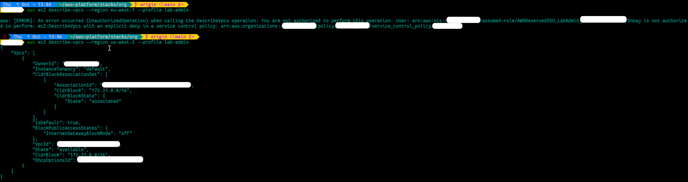

From `LabAdmin`, which has AdministratorAccess, creating an IAM user works, and creating an access key for it is denied by the SCP. The test user was deleted afterward. `deny-leave-org` isn't tested: leaving would fail anyway because `lab` has no standalone payment method, so the result would prove nothing.

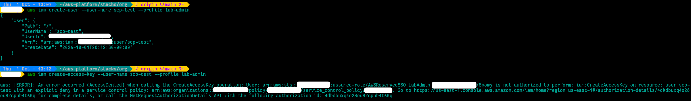

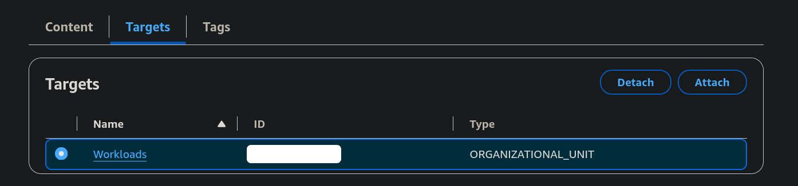

### Organization CloudTrail

One organization trail, `org-trail`, records management events from every account in the organization, in every region. It was created in the management account, with `us-west-2` as its home region. It includes global service events, has log file validation on, records both read and write management events, and records no data events, which are billed per event and nothing here needs yet. It started in project 1 because project 5 generates least-privilege policies from CloudTrail history, and the earlier it starts recording, the more history there is.

Logs land in an S3 bucket in the management account named `<prefix>-org-trail-<account-id>`, under `AWSLogs/<org-id>/<account-id>/CloudTrail/<region>/`. In a real organization this bucket would be in a dedicated log archive account. The bucket gets the same hardening as the state bucket: SSE-S3, all four public access block settings, bucket owner enforced, and a TLS-only deny. It has no versioning. A lifecycle rule expires log objects after 365 days.

The bucket policy lets CloudTrail check the bucket ACL and write log files, with every statement scoped by `aws:SourceArn` to this one trail. CloudTrail is shared by every AWS customer, so without that condition a trail in someone else's account could write into this bucket. CloudTrail checks the bucket policy when the trail is created, so the policy has to exist first and can't read the ARN from the trail. The trail ARN is built in a local from the region, the account ID, and the trail name instead. `depends_on` makes sure the bucket policy exists, and trusted access for CloudTrail is turned on, before the trail is created. Both the trail and its bucket have `prevent_destroy`.

Member accounts can see the organization trail, but they can't stop it, change it, or delete it, so no SCP is needed to protect it.

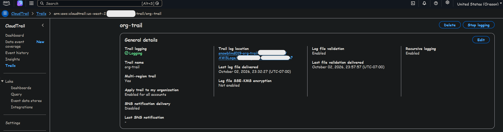

A trail only delivers events that happen after it exists. To test it, a few calls were made in `lab` after the apply, including the denied `eu-west-1` call from the SCP test, which gets logged too. Within minutes `lab` had its own folder under the organization's prefix, with `CloudTrail-Digest/` next to `CloudTrail/`. The digest files are the log file validation working: signed hourly digests that prove later whether a log file was changed or deleted.

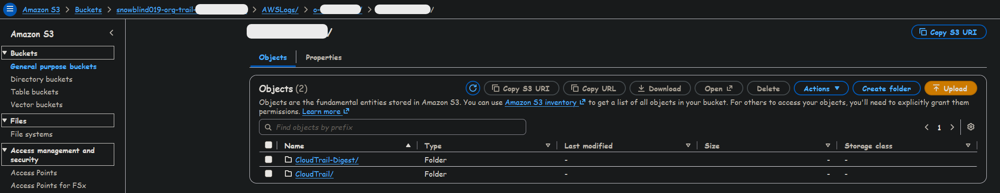

### Account defaults

<!-- S3 account public access block, EBS encryption by default, IMDSv2 by default, and which regions they cover. -->

## Cost controls

Before any project 1 work, the account's month-to-date cost was $0.00, and all of August 2026 came to $0.02. That's the baseline the rest of this project is measured against.

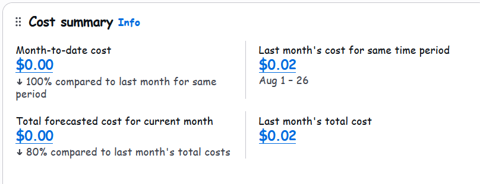

Two budgets in the management account cover every account in the organization:

| Budget | Period | Limit | Alerts |
|---|---|---|---|
| `daily-leak` | Daily | $3 | Actual spend over 100% |
| `monthly-ceiling` | Monthly | $25 | Actual spend over 80% and 100%, forecasted spend over 100% |

There's no zero-spend budget. The standing cost is above zero on purpose, so a zero-spend alert would fire every month and train me to ignore alerts. If `daily-leak` fires on a day I didn't work, something was left up overnight. Billing data updates a few times a day, so budgets react within hours, not minutes. The ephemeral check is the faster net.

Alerts go straight to email, with no SNS topic, at a separate plus-address so an inbox rule can sort them. The address comes from a gitignored `terraform.tfvars` and is marked sensitive.

A leftover hand-made $50 budget from before the project was deleted, so the code describes everything in the management account.

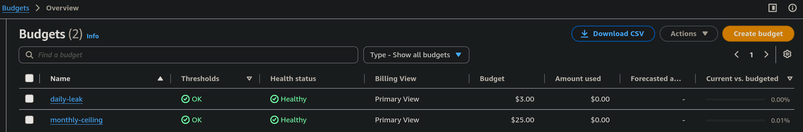

<!-- S22, moved to Phase 8: month-to-date spend was under a cent, so the test with monthly-ceiling lowered to $0.01 couldn't fire yet. -->
<!-- S22:  -->

Cost Anomaly Detection runs an AWS services monitor, which learns what normal spend looks like for each service separately and flags spikes. AWS allows only one services monitor per account, so the default one AWS had created was deleted first, and this one was created in code. A daily summary email goes out only for anomalies with $5 or more of total impact. Smaller ones still show in the console.

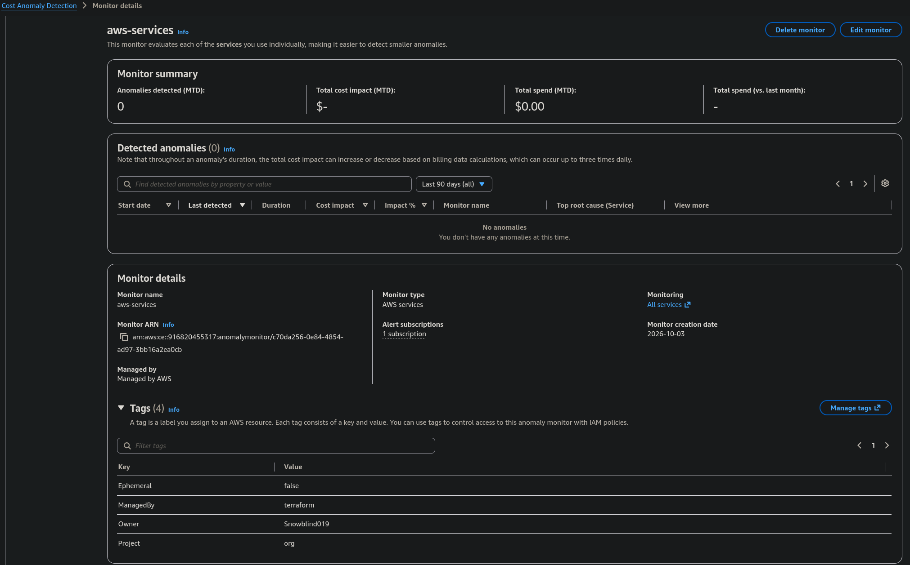

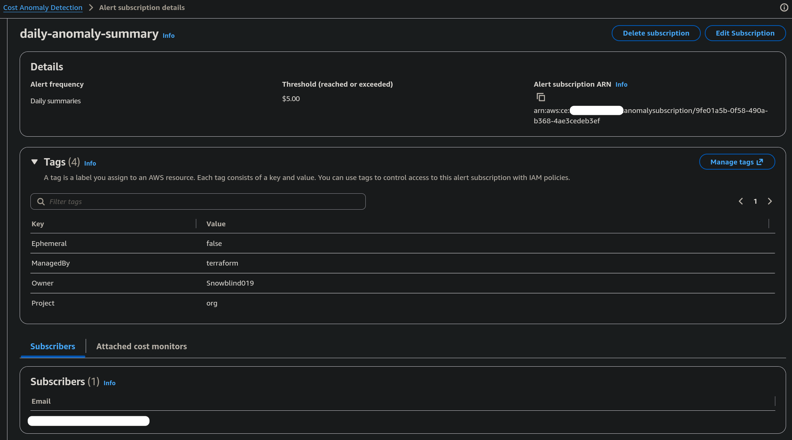

The four standard tag keys are active as cost allocation tags, so costs can be grouped by `Project` and the rest. The keys come from the tags module, `keys(module.tags.tags)`, so the module stays the only place the standard is defined. Only the Resource type is activated. The same four keys also show up as Account type, from the tags on the `lab` account itself, and those stay inactive for now. After activation, a backfill was requested so earlier tagged usage shows up in reports too.

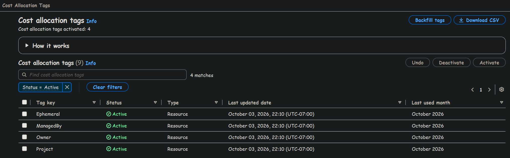

At first, Cost Explorer denied `OrgAdmin` even with AdministratorAccess. The management account had IAM access to billing information switched off, which keeps every billing page root-only no matter what a role's policies say. Root turned it on once, and billing work now goes through Identity Center like everything else.

<!-- S34:  -->

## GitHub OIDC and the ephemeral check

<!-- The OIDC provider, the read-only role and its trust conditions, and what the scheduled check looks for. -->

<!-- S25:  -->
<!-- S26:  -->
<!-- S27:  -->
<!-- S28:  -->
<!-- S29:  -->
<!-- S30:  -->

## Drift and rebuild

<!-- Clean plans, the drift test, and the foundation destroy and re-apply. -->

<!-- S31:  -->
<!-- S32:  -->
<!-- S33:  -->

## Outputs

| Output | Description | Used by |
|---|---|---|
| `allowed_regions` (`org`) | Regions the `lab` account may use, the same list `region-lock` enforces | `foundation`, through `terraform_remote_state` |
| `organization_id` (`org`) | The organization's ID. Log paths in the CloudTrail bucket start with it | Finding the log folders |
| `lab_account_id` (`org`) | Account ID of the `lab` member account | Reference |
| `trail_bucket_name` (`org`) | The S3 bucket holding the organization CloudTrail logs | Finding the logs |

## Testing the guardrails

<!-- How to reproduce each denial and check yourself, and what the expected result looks like. -->

## Decisions

<!-- The main calls made in this project, linking to entries in ../decisions.md. -->

## What broke

| Problem | Cause | Fix |
|---|---|---|
| The first import plan wanted to disable resource control policies for the whole organization | RCPs were enabled on the root, but `enabled_policy_types` only listed SCPs, and Terraform treats that list as the whole truth | Added `RESOURCE_CONTROL_POLICY` to the list before applying |
| A plan on a second machine failed with a state lock error | An earlier interrupted `plan` from the same machine left its `.tflock` object behind | Confirmed no other run was active, then `terraform force-unlock` |
| A plan on a second machine wanted to destroy and replace the `lab` account | That machine's `terraform.tfvars` had the `lab` email typed slightly differently, and a different email forces replacement | `prevent_destroy` stopped the plan. Copied the exact address from `aws organizations list-accounts` |
| `terraform init` on a second machine failed with `InvalidClientTokenId` | `AWS_PROFILE` wasn't set, so the SDK fell back to the deleted IAM user's keys still sitting in that machine's `~/.aws/credentials` | Removed the old keys and exported `AWS_PROFILE=lab-admin` |
| Cost Explorer denied `OrgAdmin` despite AdministratorAccess | IAM access to billing information was off in the management account | Root turned it on in the account settings |

## Known gaps

<!-- Phase 8 finishes this list: what a production setup would do differently, and which later project closes each one. -->

- **No dedicated log archive account.** The CloudTrail bucket lives in the management account. A real organization keeps logs in their own account.
- **The trail's log bucket has no versioning or Object Lock.** Log file validation can prove a log file was changed or deleted, but it doesn't stop someone with admin in the management account from deleting it.
- **Trail logs use SSE-S3, not KMS.** Project 8's Security Hub scan will flag it.
- **The `org` stack's state lives in `lab`, the account its own SCPs govern.** A bad `region-lock` could block Terraform from the state it would need to fix it, and the way back is a manual detach in the console. A separate tooling account for state would remove this. Revisit in projects 3 and 5.
- **`region-lock` exemptions apply in every region.** Anything on the `NotAction` list, like `kms:*`, still works in regions the policy otherwise denies.

## Cost

| Item | Amount |
|---|---|
| Baseline before the project | $0.00 month to date on 09-26-2026 ($0.02 for all of August 2026) |
| Standing monthly cost | |
| Actual spend during the project | |

## Tested with

| Tool | Version |
|---|---|
| Terraform | v1.16.4 |
| AWS provider | 6.66.0 |
| AWS CLI | 2.37.4 |
